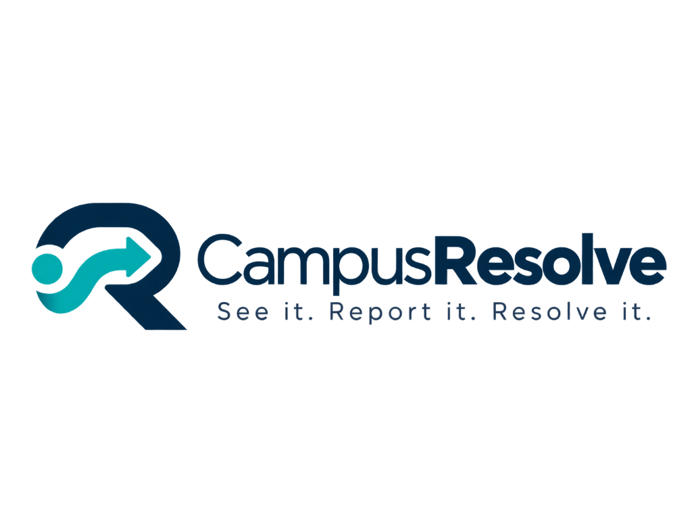

# CampusResolve

<div align="center">
  
  <p><strong>“See it. Report it. Resolve it.”</strong></p>
  <p><em>A Closed-Loop Campus Issue-to-Resolution Operating Platform</em></p>
  <p>Built for <strong>BYTEFORGE 2026</strong> · Smart Campus & Digital Infrastructure</p>
</div>

---

## 📌 Executive Summary

Campus infrastructure faults—from active water leaks to broken lab sockets and blocked wheelchair ramps—are almost always noticed first by students and faculty. However, they are traditionally reported verbally, dumped in scattered chat groups, or sent to the wrong department. Progress is invisible, duplicates multiply, and the same issues recur without institutional learning.

**CampusResolve** transforms this broken dynamic into a accountable, transparent, closed-loop workflow:
```
OBSERVATION ➔ REPORT ➔ TRIAGE ➔ ROUTE ➔ TRACK ➔ RESOLVE ➔ VERIFY ➔ LEARN
```

---

## 🚀 Key Differentiators

- **30-Second Mobile Reporting:** Photo capture, multi-level campus location picker, natural description, and objective impact flags.
- **Explainable Priority Scoring:** Calculates priority (Low, Medium, High, Critical) deterministically based on safety risk, accessibility obstruction, class disruption, resource waste, and confirmation frequency.
- **Intelligent Duplicate Prevention:** Suggests existing nearby reports to prevent redundant tickets, aggregating student confirmations (e.g., *"Confirmed by 4 students"*).
- **Automated Department Routing:** Instant rule-based routing to Electrical, Plumbing, Housekeeping, IT Support, Lab Support, or General Admin.
- **Resolution Proof & Student Verification:** Administrators cannot silently close tickets—they must submit a resolution note and photo proof. The reporter then confirms: **"YES — Verify Resolution"** or **"STILL A PROBLEM"** (reopens ticket).
- **Preventive Maintenance Intelligence:** Aggregates recurring hotspots (e.g., *"3 plumbing issues in CSE Corridor this month"*) to recommend infrastructure overhaul rather than temporary patches.

---

## 🛠 Tech Stack

- **Frontend:** Next.js 14 (App Router), TypeScript, Tailwind CSS, Framer Motion, Lucide React, Recharts
- **Design System:** Apple-inspired Liquid Glass UI (layered translucency, soft depth, backdrop blur)
- **Backend & Database:** Supabase (PostgreSQL, Row Level Security, Realtime subscriptions)
- **Storage:** Supabase Storage (`issue-images` bucket for report photos and resolution proof)
- **Auth:** Supabase Auth with strict role-based authorization (`student` vs `admin`)
- **PWA:** Installable Progressive Web App with standalone viewport and service configuration

---

## ⚡ Quick Demo Accounts

CampusResolve comes with pre-configured demo accounts ready for live evaluation:

| Role | Email | Password | Primary Capabilities |
| :--- | :--- | :--- | :--- |
| **Student** | `student@campus.edu` | `demo1234` | Report issues with photos, track progress timeline, confirm duplicates, verify resolution |
| **Admin** | `admin@campus.edu` | `admin1234` | Triage queue, acknowledge, assign departments, mark in-progress, submit photo resolution proof, view analytics |

> 💡 **Presentation Tip:** The login page features **"⚡ Quick Demo Sign-In"** buttons to auto-fill these credentials in one click!

---

## 🗄 Supabase Database Setup (1 Minute)

A single master SQL setup script is provided in [`supabase/complete_setup.sql`](./supabase/complete_setup.sql).

### Execution Steps:
1. Go to your [Supabase Project Dashboard](https://supabase.com/dashboard).
2. Click **SQL Editor** on the left menu.
3. Open [`supabase/complete_setup.sql`](./supabase/complete_setup.sql) from this repo, copy its contents, paste into the SQL Editor, and click **RUN**.
4. That's it! It automatically sets up:
   - All relational tables, enums, triggers, and sequences
   - Strict Row Level Security (RLS) policies for students and admins
   - The `issue-images` storage bucket and access policies
   - Seeded campus buildings, floors, and classrooms
   - Both pre-confirmed demo users (`student@campus.edu` and `admin@campus.edu`)
   - 7 realistic demo issues in various lifecycle states (`CR-1001` through `CR-1007`)
   - Supabase Realtime publication

---

## 💻 Local Development Setup

### 1. Clone & Install Dependencies
```bash
git clone git@github.com:joelgjojo/CampusResolve.git
cd CampusResolve
npm install
```

### 2. Configure Environment Variables
Create a `.env.local` file in the root directory:
```env
NEXT_PUBLIC_SUPABASE_URL=https://fprautsfmnymgmynbjgv.supabase.co
NEXT_PUBLIC_SUPABASE_ANON_KEY=sb_publishable_qmsayexPft8_AMXKrwJHlg_RYe9QVyP
```
*(A template is also available in `.env.example`)*

### 3. Run Development Server
```bash
npm run dev
```
Open [http://localhost:3000](http://localhost:3000) in your browser.

### 4. Verify Production Build
```bash
npm run build
```

---

## 🎬 5-Minute Hackathon Demo Script

For a flawless presentation to judges, follow this 5-scene storyline:

### Scene 1: Student Observation & Rapid Report (Mobile View)
- Open CampusResolve on phone or simulated mobile view (`http://localhost:3000`).
- Sign in with **Fill Student Demo**.
- Tap **"Report an Issue"**.
- Upload or snap a photo of a water leak.
- Select Category: **Plumbing / Water**.
- Select Location: **CSE Department ➔ CSE Corridor**.
- Enter Description: *"Water leaking from overhead pipe near classroom entrance."*
- Select Impact Flags: **Water Wastage** + **Safety Risk (slip hazard)**.
- Review and tap **Submit Report**.
- System generates **`CR-1008`**, scores it as **HIGH Priority**, and auto-routes to **Plumbing & Maintenance**.

### Scene 2: Authority Operations & Triage (Desktop View)
- Open the Admin Dashboard on a second window (`/admin`).
- Notice the new ticket appears in real-time without refreshing.
- Click into the ticket detail:
  - Show photo, location, assigned department, and the **"Why High Priority?"** breakdown.
- Click **"Acknowledge Issue"** ➔ Status transitions to **Acknowledged**.
- Click **"Assign Issue"** (Plumbing & Maintenance) ➔ Status transitions to **Assigned**.
- Click **"Start Work"** ➔ Status transitions to **In Progress**.

### Scene 3: Duplicate Prevention & Evidence Aggregation
- Open a second student window and attempt to report a leak in the **CSE Corridor**.
- CampusResolve instantly alerts: *"Similar issue found (CR-1008)"*.
- Tap **"Yes, Same Issue"**.
- Admin dashboard updates: *"Confirmed by 2 students"*, raising priority context without ticket clutter.

### Scene 4: Accountable Resolution & Reporter Verification (The Closed Loop)
- Admin marks issue **"Resolved"**:
  - Enters resolution note: *"Pipe joint sealed and high-pressure valve replaced."*
  - Uploads resolution proof photo.
- Student opens **My Issues ➔ CR-1008**:
  - Sees the banner: *"Has this issue been resolved?"*
  - Reviews the maintenance team's photo proof and resolution note.
  - Taps **"Yes, Verified"** ➔ Status advances to **VERIFIED**.

### Scene 5: Institutional Intelligence (Analytics & Prevention)
- Switch to Admin **Analytics & Insights** (`/admin/analytics`).
- Highlight **Recurring Hotspots**:
  - *"3 plumbing incidents reported in CSE Corridor this month."*
  - **Actionable Takeaway:** *"CampusResolve doesn't stop at tracking tickets. It turns repeated complaints into preventive maintenance intelligence."*

---

## ☁️ Deployment (Vercel)

1. Push your repository to GitHub.
2. Import the repository in [Vercel](https://vercel.com).
3. Set the Environment Variables:
   - `NEXT_PUBLIC_SUPABASE_URL`
   - `NEXT_PUBLIC_SUPABASE_ANON_KEY`
4. Deploy! Next.js 14 App Router and PWA manifests deploy out-of-the-box.

---

<div align="center">
  <sub>CampusResolve · ByteForge 2026 · Smart Campus & Digital Infrastructure</sub>
</div>
